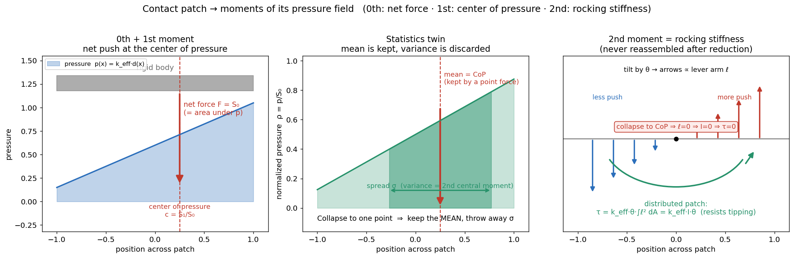

# Hydroelastic Contact Reduction — The Physics and What It Preserves

A single reference for Newton's hydroelastic contact reduction: the
first-principles physics it rests on (the **moments** of a contact-pressure
field), what the reduction pipeline does, and which equivalences it keeps or
discards. Verified against the source in `newton/_src/geometry/`
(`sdf_hydroelastic.py`, `contact_reduction_global.py`,
`contact_reduction_hydroelastic.py`, `contact_reduction.py`) and the MuJoCo
contact conversion in `newton/_src/solvers/mujoco/kernels.py`; the factor-of-2
export and the `1e-8` / `1e-20` thresholds were re-verified in
`contact_reduction_hydroelastic.py` (lines 831, 63–64). Companion figure:
`contact_moments_explainer.png`.

---

## Part 1 — The physics: moments of a contact-pressure field

### Contact is a pressure distribution

When two bodies press together they touch over a small **patch**, not a point,
and across it there is a **pressure field** `p(x)` (force per unit area, Pa) — a
carpet of tiny springs, each pushing harder where the squeeze is deeper, zero at
the edges. For hydroelastic contact:

```
p(x) = k_eff * d(x)        d(x) = local penetration depth
```

The pressure pushes along the local surface normal `n`. (Assume one flat patch
with a single normal `n` for now — relaxing that is exactly where reduction's
troubles appear.)

### A rigid body feels only the wrench

A rigid body cannot feel the *shape* of the pressure field — only its **net
force** and **net torque** (together a *wrench*). Two different distributions
with the same wrench are mechanically identical to it. So "how much of `p(x)`
must we keep?" becomes "how many **moments** of `p(x)` pin down the wrench?" Pick
a reference point `O`; let `r = x − O`:

| Moment | Definition | Units |
|---|---|---|
| 0th `S₀` | `∫ p dA` | N |
| 1st `S₁` | `∫ p·r dA` | N·m |
| 2nd `S₂` | `∫ p·r² dA` | N·m² |

### 0th → net force, 1st → center of pressure, 2nd → rocking

**0th — net force.** `F = ∫ p·n dA = n·S₀`. The total push (area under `p`).

**1st — center of pressure.** Torque about `O` is
`τ_O = ∫ r × (p n) dA = (∫p r dA) × n = S₁ × n`. A single point force `F = S₀ n`
at `c` reproduces it when `c × (S₀ n) = S₁ × n`, i.e.

```
c = S₁ / S₀ = ∫p·r dA / ∫p dA
```

the **center of pressure** — the centroid of the pressure field, the exact
analog of center of mass. So one point force at the CoP reproduces the 0th and
1st moments *exactly — for a flat, single-normal patch*. When `n` varies across
the patch, `∫ r × (p n) dA` no longer factors as `S₁ × n` and one point force
cannot match it (the residual couple `Δτ` and an un-makeable spin torque — see
the anchor knob in Part 2).

**2nd — rocking stiffness.** Tilt by a small angle `θ` about an in-plane axis
through the CoP; patch at lever arm `ℓ` penetrates extra by `ℓθ`:

```
δp = k_eff·ℓθ,   dF = k_eff·ℓθ dA,   dτ = ℓ·dF
τ_restore = k_eff · θ · ∫ℓ² dA = θ · (k_eff · I)        I = ∫ℓ² dA  (2nd moment of area)
```

So **rocking stiffness = k_eff · I**. A single point force has `ℓ = 0 → I = 0 →`
**zero rocking stiffness**. The only way to keep rocking is to keep a
*spread-out set* of contacts so their incidental `Σ k·rᵢ²` approximates
`k_eff·I` — which is exactly why reduction keeps a *set* of contacts (≤240 per
pair) rather than one resultant.

Each moment has a familiar mechanical twin:

| Moment | Mechanical meaning | Familiar twin |
|---|---|---|
| 0th | net force | total mass |
| 1st / 0th | center of pressure | center of mass |
| 2nd | rocking / tilt stiffness | area moment of inertia `I` |

### The statistics twin

Normalize the pressure to a density `ρ(x) = p(x) / S₀`:

| Moment | Statistics | Contact mechanics |
|---|---|---|
| 0th | normalization | net force |
| 1st / 0th | **mean** `E[x]` | center of pressure |
| 2nd central | **variance** `Var[x]` | rocking stiffness |

Collapsing a patch to one point force keeps the **mean** (where the force acts on
average) and throws away the **variance** (the spread) — and spread is exactly
what resists tipping.

### The ladder runs twice

Everything above was the **normal** pressure. Friction adds a **tangential**
traction field `t(x)` (bounded by `|t| ≤ μp`); its moments mean:

| Moment of `t` | Meaning |
|---|---|
| 0th — `∫t dA` | net friction force (resists sliding) |
| 1st, projected on `n` | spin / drilling / yaw torque (resists twisting in place) |

A point contact has zero lever → zero spin resistance; a spread patch resists
twist. So the moment ladder runs once on normal pressure (→ push, CoP, rocking)
and once on tangential traction (→ friction force, spin capacity).

### The figure



1. **Panel A — 0th + 1st:** the pressure carpet `p(x) = k_eff·d(x)` under a
   tilted body; the area under it is the net force `S₀`, drawn as one arrow at
   the center of pressure `c = S₁/S₀`.
2. **Panel B — statistics twin:** the same field as a density; the **mean** (CoP,
   kept by a point force) versus the **variance σ** (the spread, discarded).
3. **Panel C — 2nd moment:** a small tilt `θ` makes incremental forces ∝ lever
   arm `ℓ`, summing to a restoring torque `τ = k_eff·I·θ`; collapsing to the CoP
   sends `ℓ → 0`, so `I → 0` and rocking stiffness vanishes.

---

## Part 2 — What reduction does (and what it keeps)

Reduction throws away the carpet and replaces it with a handful of representative
contacts ("thumbtacks") chosen so they reproduce those moments. This is the
statics trick — replace a distributed load with one equivalent resultant —
**exact only for a rigid body in static balance**. Real contact is springy,
frictional, and dynamic, so "same resultant" guarantees the box rests at the
right height carrying the right weight, and little else automatically. Each knob
adds back one more moment: **right total push → right direction → right balance
point (CoP) → right twist resistance.** By default only the first two are on.

### The picture

Dense (`reduce_contacts=False`) is the **field of springs**: each marching-cubes
face is one contact, stiffness ∝ penetrating area, at the face centroid with the
face normal. Every physical quantity (force, CoP, tilt stiffness, twist
resistance) emerges from that distributed field.

Reduction is a **per-bin quadrature** of that field: group faces by normal
direction (20 icosahedral bins), compute the low-order moments per bin, pick a
sparse set of *representative* winners, and rescale them so the chosen moments
are reproduced. By default it guarantees only the **0th moment (net force) and
direction**; higher knobs add the 1st moment and the friction moment.

### The pipeline

1. **Generate + aggregate.** Per (shape-pair × normal-bin), accumulate over
   **all** faces: `agg_force = sum(area*|d|*n)` (vector),
   `weighted_pos_sum = sum(area*|d|*pos)`, `weight_sum = sum(area*|d|)`. Center of
   pressure = `weighted_pos_sum / weight_sum`. (Runs before any selection.)
2. **Select winners** per bin: 6 support-polygon **extreme** slots (gated by a
   small `BETA` depth threshold) + 1 **max-depth** slot = 7 per normal bin
   (×20 = 140), plus up to 100 **deepest-per-voxel** slots = **≤240 per pair**.
   Each slot is a single atomic-max winner.
3. **Redistribute + export.** Each winner gets
   `contact_stiffness = k_eff*|agg_force|/total_depth`, so the winner forces sum
   back to the dense net force *as an internal reduction-layer invariant*.

The "net force" carries a **factor of 2**: faces are exported with
`contact_distance = 2*depth` (`contact_reduction_hydroelastic.py:831`), so the
solver penetration is `2|d|` and each face force is `(area*k_eff)*(2|d|)`. The
dense net is therefore `F = 2*k_eff*agg_force`, and the *same* factor 2 is
carried in the reduced path (including the anchor, line 857), so
`F_reduced = 2*k_eff*|agg_force| = |F_dense|` **by construction**. This is a
quasi-static linear-spring *proxy*, not the realized force: both paths then pass
through MuJoCo's per-contact `solref` / `solimp` identically, so the sum-back is
an invariant of the reduction layer, not a guarantee about the solved force.

### The knobs

| Knob (default) | What it does | What it buys |
|---|---|---|
| `reduce_contacts` (True) | master on/off | off = dense field; on = the whole pipeline |
| `normal_matching` (True) | rotates winners so their depth-weighted normal sum aligns with `agg_force`; sets the stiffness denominator to `\|total_normal_reduced\|`. Gated by `EPS_LARGE = 1e-8` (`agg_force_mag > 1e-8`) | makes net force **direction + magnitude exact** (compensates normal cancellation) — the 0th moment |
| `anchor_contact` (False) | emits a synthetic contact at the center of pressure carrying max-pen depth | pins the **1st moment (CoP)** -> faithful net torque **in the planar / single-normal limit only**. Across a spread normal bin it cannot make the spin/drilling torque about the resultant normal and leaves a residual couple `dtau = K * sum w_i (c_i - c_bar) x (n_i - n_eff)`; the code matches force *magnitude* (effective-depth) but not these torques |
| `moment_matching` (False; auto-enables anchor) | rescales per-contact friction so the reduced **friction moment** `sum(pen*lever)` (variance `sum(pen*lever^2)` is the normalizer) about the CoP matches dense | restores resistance to **in-plane rotation** (yaw / tip about CoP) |
| `pre_prune_contacts` | local-first compaction that drops dominated faces before buffering (also triggers `buffer_fraction`) | less buffer pressure; experiments keep it **off** so the aggregate sees all faces |
| `buffer_mult_iso/contact`, `buffer_fraction` | size the iso / face / voxel buffers | fewer overflows (overflow biases CoP/torque, though net force survives via the aggregate) |
| `NUM_NORMAL_BINS` (20, icosahedron) | angular resolution of normal binning | finer = better for curved / multi-normal patches; each bin is an independent reduction unit |
| `NUM_SPATIAL_DIRECTIONS` (6) | support-polygon extreme slots per bin | how well the footprint **boundary** (tipping / stability) is captured |
| `NUM_VOXEL_DEPTH_SLOTS` (100) | deepest-per-voxel coverage | spatial spread; fewer frame-to-frame winner jumps |
| `BETA_THRESHOLD` (0.1 mm) | only contacts deeper than `beta*aabb` join the extreme competition | keeps the load-bearing deep contacts as the boundary; shallow ones only fill max-depth |
| `deterministic` (False) | fingerprint tiebreak in atomic-max | reproducible winners regardless of GPU scheduling (less tie-driven chatter) |
| `margin_contact_area` (1e-2) | area proxy for non-penetrating margin contacts | stiffness for just-touching faces |

How they stack: **`normal_matching` -> 0th moment exact; `anchor_contact` -> adds
the 1st moment; `moment_matching` -> adds the friction moment.** Off by default
means "net force only."

### What is preserved (verified)

| Quantity | Status |
|---|---|
| Net force magnitude (per bin) | exact as the internal `2*k_eff*agg_force` invariant, given `normal_matching` on, `\|total_normal_reduced\| >= 1e-8`, `agg_force_mag > 1e-8`, and no hashtable overflow. The "collapse to zero" fallback is a real branch but an **unreachable-by-default tail** (see Part 3), not a default hazard |
| Net force direction | preserved (`normal_matching`) |
| Per-bin / per-direction force | preserved independently (good for wedges / gears) |
| Net force under contact-buffer overflow | **buffer-proof** — the aggregate is summed before the capacity-limited contact buffer. **Not hashtable-proof**: a hashtable-insert failure silently drops that face from `agg_force` |

### What is NOT modeled (no knob fully fixes)

1. **2nd moment of the normal pressure (rocking / tilt stiffness, ~`sum(k*r^2)`).**
   Never formed. The 6 extreme slots *structurally* keep a spread-out footprint,
   but nothing targets the tilt-stiffness value -> rocking frequency /
   settle-under-eccentric-load differs.
2. **The continuous pressure distribution itself.** Collapsed to ≤240 discrete
   points per pair; only the 0th (and optionally 1st) moment is matched, not the
   shape.
3. **Time continuity.** Winners are discrete atomic-max argmaxes, so contact
   *positions* jump as the body moves (the aggregate stays smooth).
   `deterministic` removes only tie-noise, not the structural chatter.
4. **Transient / dynamic compliance.** The same net stiffness is packed into
   fewer, far stiffer springs. At matched *net* stiffness the lumped continuous
   frequency is identical; the divergence is a **per-contact, finite-timestep**
   effect — each winner's own `solref` reference oscillator is about `sqrt(N/K)x`
   faster (winners stiffer by ~N/K), and the per-contact stiffness->`solref` map
   is nonlinear (`timeconst = sqrt(1/(ke*(1-imp)))`). So impact peak force and
   ring-down differ even at matched net force.
5. **Disjoint patches sharing a normal bin are merged.** The hashtable key is
   `(shape_a, shape_b, bin_id)` with no *dedicated* position field -> one
   `agg_force` / CoP for both. The *pure normal load is still exact*, and the
   catastrophic ~100% rocking error is **mostly avoided** because winners stay at
   their original `+/-a` positions, not the gap; the blindness bites indirectly
   via (i) a gap-centered anchor (zero rocking lever, dilutes force), (ii)
   selection misses, and (iii) friction levers measured about the gap centroid.
   Voxel slots add coarse positional coverage (their `bin_id` encodes a quantized
   region) but the force / CoP still come from the single merged per-bin
   aggregate.
6. **Per-contact torsional / rolling friction.** A solver / material channel
   (`mu_torsional`, `mu_rolling`, `condim`), zero in the experiments.
   `moment_matching` addresses the *emergent lever-arm* friction moment, not a
   per-contact spin constraint.
7. **The full frictional limit surface (slide-spin coupling).** Even with
   `moment_matching` on, it is an approximate per-bin moment match, not the
   complete coupled-slip behavior.

### Which knob closes which gap

1. Net force / direction wrong -> `normal_matching` (already on).
2. Net torque / CoP wrong (tipping, eccentric load) -> `anchor_contact`.
3. Twist / yaw resistance wrong -> `moment_matching` (pulls in anchor too).
4. Curved / multi-normal patch faceting -> more `NUM_NORMAL_BINS`.
5. Footprint boundary (stability) -> more `NUM_SPATIAL_DIRECTIONS`.
6. Spatial coverage / winner jumps -> more `NUM_VOXEL_DEPTH_SLOTS`, or
   `deterministic`.
7. Overflow biasing CoP -> larger `buffer_mult_*`.

The residual — **rocking / tilt stiffness (2nd moment), transient compliance,
and time-continuity chatter** — is closed by no knob. That is the irreducible
non-equivalence, and exactly where the strongest falsification experiments
(impact transient, rocking-stiffness probe, sliding chatter) should aim.

---

## Part 3 — Corrections and open questions

### Refuted earlier conjectures

1. *Normal-bin seams break the net force* — false. `agg_force` is a vector
   partial-sum per bin and the per-bin rescale recombines onto each bin's own
   direction, so the global resultant is preserved across splitting (with
   `normal_matching` on). Seams only cost winner sparsity / per-bin faceting.
2. *Buffer overflow biases the net force* — false **for the contact buffer**. The
   aggregate is accumulated before the buffer write, so a dropped face still
   contributes to `agg_force`; surviving winners scale up to carry the full
   force. (Also, the `0.5` buffer fraction applies only when `pre_prune` is on,
   off in the experiments.) Caveat: buffer-proof, **not** hashtable-proof — a
   hashtable-insert failure does silently drop that face from `agg_force`.

### What the later audit corrected

1. **Identity.** The reduced/dense net-force match is `F = 2*k_eff*agg_force`
   (factor of 2 from `contact_distance = 2*depth`), and it is an *internal
   reduction-layer invariant* — a quasi-static linear-spring proxy — not the
   realized solver force, which both paths route through `solref` / `solimp`
   identically.
2. **Anchor is planar-only.** `anchor_contact` reproduces the 1st moment exactly
   only for a coplanar / single-normal patch; across a spread normal bin it
   misses the spin/drilling torque and a residual couple `dtau`.
3. **Collapse-to-zero is a tail, not a hazard.** The normal-cancellation fallback
   (`|total_normal_reduced| < 1e-8`) is real but effectively unreachable by
   default: within a 20-bin icosahedron no opposing normals share a bin, so
   winner normals stay in a narrow cone and `|total_normal_reduced|/S0` stays
   O(1) while real penetration exists.
4. **Threshold.** The direction-reliability gate is `EPS_LARGE = 1e-8`
   (`agg_force_mag > 1e-8`); the much smaller `EPS_SMALL = 1e-20` only gates
   *nonzero* stiffness. (Both confirmed in `contact_reduction_hydroelastic.py`,
   lines 63–64.)
5. **Buffer-proof, not hashtable-proof.** `agg_force` survives contact-buffer
   overflow (summed first) but a hashtable-insert failure silently drops that
   face's contribution.
6. **Transient is per-contact.** At matched net stiffness the lumped continuous
   frequency is identical; the impact divergence is a per-contact finite-dt
   effect (each winner's `solref` oscillator ~`sqrt(N/K)x` faster).
7. **Disjoint-patch error is mostly avoided.** Pure normal load stays exact and
   the worst-case rocking error is largely sidestepped because winners keep their
   original positions; the blur bites only via the gap anchor, selection misses,
   and gap-centered friction levers.

### Open item (unverified)

With `anchor_contact = True`, one synthetic anchor per active normal bin is
emitted *beyond* the 240 selection slots; with up to 20 active bins that is 260,
above the 255 (`MAX_CONTACTS_PER_PAIR`) ceiling implied by the 8-bit `bin_id`.
Whether this actually overflows depends on how the output buffer is sized and
whether anchors count against `MAX_CONTACTS_PER_PAIR` — not yet checked against
the source.

---

## One-line version

A contact patch is a pressure field; reduction keeps its low-order **moments** —
0th (net force, the genuinely protected quantity, as the internal
`2*k_eff*agg_force` invariant), 1st (center of pressure, with `anchor_contact`),
and — only if it keeps a spread-out set — the 2nd (rocking and twist) — and
discards the rest. Keeping just the 0th and 1st is keeping the mean of a
distribution and dropping its variance: faithful for a rigid body in static
balance (so "does it rest holding the right weight?" always passes), and blind
exactly where the *spread*, not the *resultant*, is what counts — rocking,
impact, and sliding flicker.
